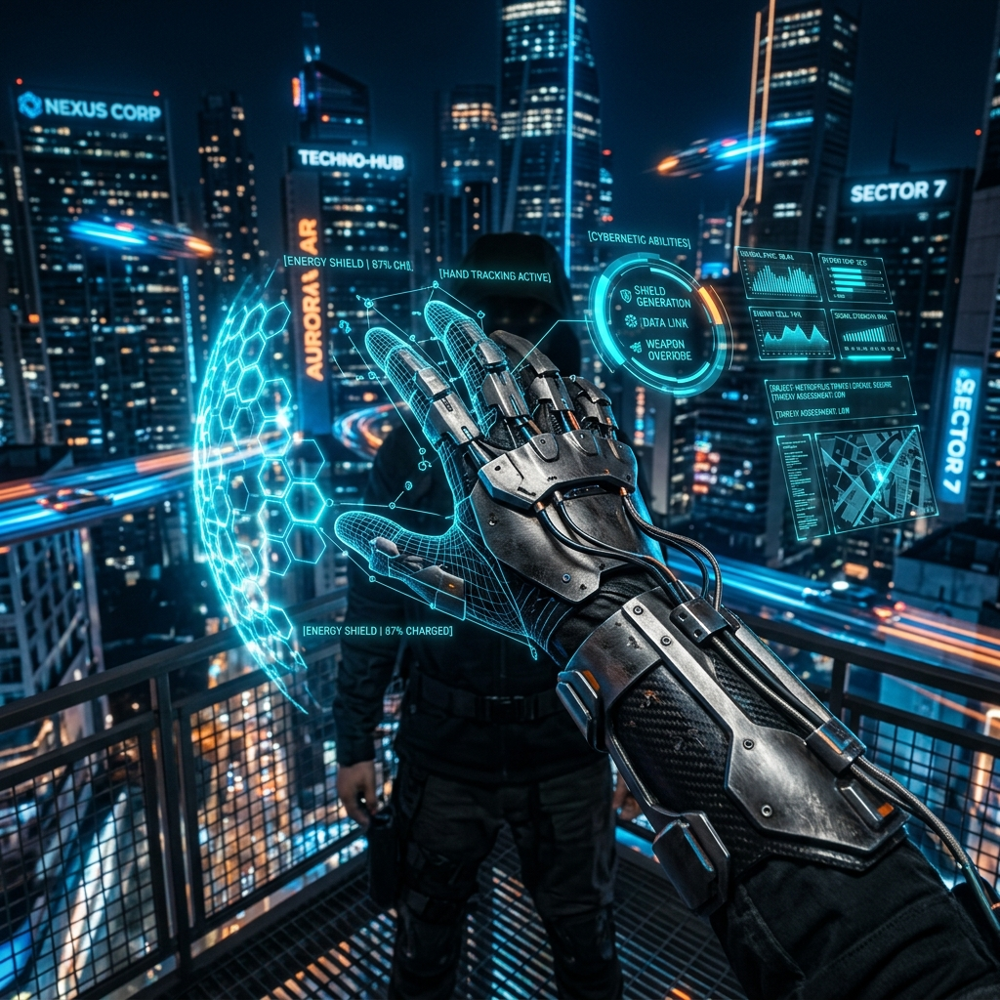

# ✨ MagicHand: Cybernetic AR Gesture Engine



MagicHand is a high-performance, web-based Augmented Reality engine designed for real-time hand gesture recognition and visual effect overlays. It provides a modular framework for developers to create immersive "Cybernetic Abilities" triggered by natural hand movements.

## 🌟 Key Features

- 👋 **Precision Hand Tracking**: Powered by MediaPipe Vision for sub-millisecond latency and high accuracy.
- 🎭 **Advanced Gesture Recognition**: Multi-pose sequence detection (e.g., Charge ➔ Release) for complex interaction.
- 🧩 **Pluggable Architecture**: Completely modular plugin system for defining new abilities and visuals.
- ⚡ **Optimized FX Pipeline**: Custom 2D canvas-based renderer for lightweight and responsive visual effects.
- 📱 **Mobile-First Design**: Built with Next.js 15+ and Tailwind CSS 4, optimized for smooth performance on modern browsers.

## 🛠️ Tech Stack

- **Framework**: [Next.js](https://nextjs.org/)
- **Computer Vision**: [MediaPipe](https://developers.google.com/mediapipe) (Hand Landmarker)
- **State Management**: [Zustand](https://github.com/pmndrs/zustand)
- **Styling**: [Tailwind CSS 4](https://tailwindcss.com/)
- **Icons**: [Lucide React](https://lucide.dev/)

## 🚀 Getting Started

### 1. Installation

```bash
git clone https://github.com/username/MagicHand.git
cd MagicHand
npm install
```

### 2. Run Development Server

```bash
npm run dev
```

Visit [http://localhost:3000](http://localhost:3000) to launch the AR interface.

## 🔮 Integrated Abilities

| Ability | Trigger Gesture | Visual Output |
| :--- | :--- | :--- |
| **Energy Shield** | Open Hand (Hold) | Hexagonal holographic shield with cyan pulse |
| **Kinetic Blade** | Fist ➔ Two Fingers | High-velocity energy slash with digital sparks |
| **Thermal Cannon** | Pinch (Charge) ➔ Open Hand | Focused thermal beam and overheating debris |

## 🧩 Extension System

MagicHand is built for extensibility. New abilities can be added by creating a plugin in `src/plugins`.

1. **Define Poses**: Create scoring logic using hand landmark geometry.
2. **Implement Visuals**: Build an FX class to handle the update/draw cycle.
3. **Register Gesture**: Define the sequence and timing for activation.

Refer to [How to Create a Technique](HOW_TO_CREATE_TECHNIQUE.md) for a detailed technical walkthrough.

## 🏛️ Project Architecture

- `src/core`: The "Heart" — camera management, MediaPipe workers, and gesture dispatch.
- `src/plugins`: Modular "Abilities" containing pose definitions and visual effects.
- `src/components`: React UI layer for camera views and HUD overlays.
- `public/models`: Localized ML models for offline-capable hand tracking.

---

*Harnessing the power of AR through natural interaction.*
